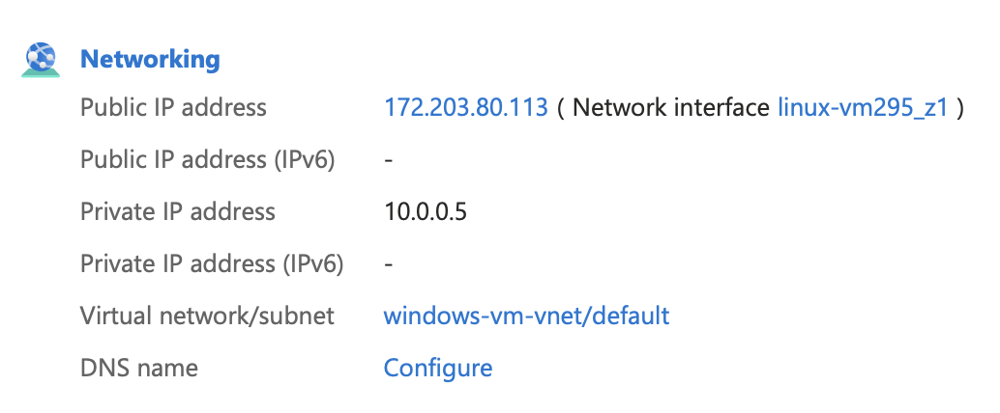

# Monitoring ICMP Traffic with Wireshark & Security Protocols on Azure

## Step 1: Access Azure Portal
- Go to [https://portal.azure.com](https://portal.azure.com)
- Confirm your Windows and Ubuntu VMs are running

## Step 2: Launch Microsoft Remote Desktop (macOS)
- Install Microsoft Remote Desktop from the App Store (if not already installed)
- Connect to your Windows 10 VM

## Step 3: Download and Install Wireshark
- Visit [https://www.wireshark.org/download.html](https://www.wireshark.org/download.html)
- Download the 64-bit Windows installer


## Step 4: Complete Wireshark Setup
- Run the installer
- Accept licenses and allow Npcap installation
- Skip USBcap installation


## Step 5: Launch Wireshark
- Open Wireshark and select the Ethernet interface
- Begin capturing traffic

## Step 6: Observe Traffic
- Initially, you’ll see lots of traffic before applying any filters

## Step 7: Filter for ICMP Traffic
- In the display filter bar, type `icmp` to isolate ping traffic


## Step 8: Open PowerShell as Admin
- Right-click → “Open PowerShell (Admin)”


## Step 9: Copy Ubuntu VM's Private IP from Azure
- Go to your Ubuntu VM in Azure and copy its private IP address

## Step 10: Run Ping Command in PowerShell
- In PowerShell, type:
  ```powershell
  ping 10.0.0.5
  ```
- Return to Wireshark to observe filtered ICMP traffic

  


## Step 11: Start Continuous Ping
- In PowerShell:
  ```powershell
  ping 10.0.0.5 -t
  ```


## Step 12: Observe ICMP Requests and Replies
- Wireshark should show a stream of Echo requests and Echo replies

## Step 13: Apply NSG Rule to Block ICMP
- Go to the Ubuntu VM’s Network Security Group
- Add a new **Inbound rule**:
  - Protocol: `ICMPv4`
  - Action: `Deny`
  - Priority: Lower than existing allow rules


## Step 14: Observe Ping Timeouts
- Ping should now display: `Request timed out`
- Wireshark shows ICMP requests but **no replies**


## Step 15: Remove/Disable the ICMP Deny Rule
- Go back to the NSG
- Remove or disable the deny rule

## Step 16: Confirm Ping Recovery
- You should start seeing ICMP replies again in Wireshark


